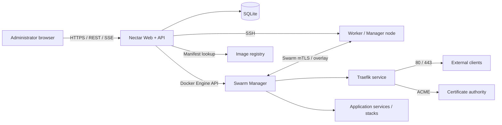

<!-- SPDX-License-Identifier: AGPL-3.0-only -->

# Nectar Product and Technical Plan

> Document status: Draft 0.2
> Goal: initialize a Linux server as a Docker Swarm Manager, then use a Web interface to enroll nodes, standardize Docker versions, provide automatic HTTPS through Traefik, and deploy explicit application image versions.

This document describes the intended product and architecture. Features that are already implemented are identified in the repository README and changelog; roadmap items in this document must not be interpreted as completed behavior.

## 1. Product Positioning

Nectar is a lightweight Docker Swarm management tool built around a simple model: install the control plane first, then expand the cluster from that control plane.

It addresses five core needs:

1. An operator can choose a Docker Engine version, install Docker on the first server, initialize Swarm, and deploy Nectar.
2. Nectar provides a Web management interface, so routine work does not require handwritten Swarm commands.
3. An operator can add Linux servers over SSH; Nectar checks the environment, installs the same Docker version, and joins each server to the Swarm.
4. Nectar installs and manages Traefik, discovers routes from service labels, and obtains and renews HTTPS certificates.
5. An operator can enter an image repository, image version, and deployment settings to create or upgrade a service while observing progress, health, and rollback options.

### 1.1 Target Users

- Small teams and individual developers operating approximately 2–20 Linux servers.
- Operators who want to retain Docker and Compose workflows without adopting Kubernetes.
- Self-hosting environments that need repeatable deployments, rolling updates, automatic HTTPS, and basic cluster management.

### 1.2 Out of Scope for the First Release

- A general-purpose server administration panel.
- Kubernetes, Nomad, or standalone Docker orchestration.
- Domain registration. The first release only checks DNS; DNS provider API integrations come later.
- Multiple active Nectar writers managing the same cluster.
- A complete CI/CD product. The first release triggers deployments through the Web UI or API; webhooks come later.

## 2. User Experience

### 2.1 Installing the First Manager

The operator runs one command on the Linux host that will become the first Manager. After a release is published:

```bash
curl -fsSL https://github.com/nectarops/nectar/releases/download/v0.1.0/install.sh \
  | sudo bash
```

Docker Engine version and Manager address can be supplied non-interactively:

```bash
curl -fsSL https://github.com/nectarops/nectar/releases/download/v0.1.0/install.sh \
  | sudo bash -s -- \
      --docker-version <target-version> \
      --advertise-addr <manager-static-ip> \
      --web-port 8080
```

The installer performs these steps:

1. Check the operating system, CPU architecture, root privileges, network ports, and existing Docker/Swarm state.
2. Query Docker's official repository for versions available to the distribution and validate the requested version.
3. Install pinned Docker Engine, CLI, containerd, Buildx, and Compose plugin packages.
4. Merge and validate bounded `json-file` log rotation in `/etc/docker/daemon.json`, then restart Docker only if that file changed.
5. Enable Docker at boot and verify that the daemon is available.
6. Initialize Swarm with a stable advertise address when the host is not already a member.
7. Create required data directories, Docker secrets, and control-node labels.
8. Start Nectar as a pinned Swarm service constrained to a labeled Manager and publish only its Web port.
9. Wait for the Nectar readiness check.
10. Print the exact Web setup URL, one-time initialization token, and required follow-up actions.

The installer does not create the ingress network, install Traefik, or publish ports 80 and 443.
Those changes happen only after a signed-in Owner submits both a management domain and ACME email, or
when the operator later deploys an application requiring ingress.

If Docker is already installed, the installer must never replace it silently. It must show the current and requested versions and require explicit authorization before an upgrade or downgrade.

Because `curl | sudo bash` executes remote content as root, every release must also document an equivalent download, inspect, checksum-verify, and execute flow. Every downloaded release artifact other than container image layers must have a verified checksum or signature.

### 2.2 First Web Visit

The complete first-run wizard is intended to cover:

1. Create the first Owner account using the one-time initialization token.
2. Configure site name, time zone, and log retention.
3. Confirm Manager advertise and external access addresses.
4. Configure registry credentials, with public registries supported without credentials.
5. After login, configure the Traefik domain, ACME email, challenge type, and ingress node.
6. Run cluster health checks and enter the overview.

The initialization token must become unusable after setup and must never appear in ordinary application logs.

The current alpha creates the Owner account first over `IP:8080`. After login, the Owner uses a dedicated **HTTPS access** page to submit the management domain and ACME email. Nectar then installs or reconciles Traefik and persists the access settings in SQLite. The published IP port remains available for recovery.

### 2.3 Adding a Server

The **Nodes → Add node** workflow collects:

- Hostname or IP address, SSH port, and SSH user.
- Authentication method, preferring private keys while supporting passwords for compatibility.
- `sudo` method.
- Worker or Manager role.
- Advertise address and data-path address, with optional safe discovery.
- Node labels such as `region=shanghai` and `disk=ssd`.

The operation follows this sequence:

```text
SSH connectivity check
  → host-key fingerprint confirmation
  → operating-system and port preflight
  → existing Docker and Swarm inspection
  → target-version availability check
  → Docker installation or version alignment
  → short-lived join-token retrieval
  → Swarm join
  → Manager-side Ready confirmation
  → node-label update
  → remote temporary-file and secret cleanup
```

Each step shows status, duration, and redacted logs. A failed operation resumes from a safe step instead of repeating all changes blindly.

### 2.4 Deploying an Application

The first release provides two deployment paths.

#### Simple Form

- Application and service name.
- Image repository, for example `registry.example.com/team/api`.
- Explicit image version, for example `1.4.2`; implicit `latest` is prohibited.
- Internal container port.
- Replica count and CPU/memory limits.
- Environment variables and Docker secrets/configs.
- Domain, path, and HTTPS setting.
- Health check, rolling-update, and rollback policy.
- Node constraints and networks.

#### Stack YAML

Advanced operators can import a Compose file compatible with `docker stack deploy`. Before saving, Nectar validates its schema, images, networks, secret references, and Traefik labels and shows the resulting diff.

After **Deploy** is selected, Nectar:

1. Normalizes and validates the deployment specification.
2. Validates private-registry credentials and the image manifest when applicable.
3. Resolves the tag to a digest when possible and records both requested tag and resolved digest.
4. Generates the Swarm service/stack specification and Traefik service labels.
5. Creates the service or performs a rolling update.
6. Observes tasks reaching Running, health checks succeeding, and the Traefik route becoming reachable.
7. Marks the release successful or applies the configured pause/rollback policy on failure or timeout.

When a new version is entered for an existing application, the UI should show:

```text
Current: registry.example.com/team/api:1.4.2
Target:  registry.example.com/team/api:1.5.0
Policy:  start-first, parallelism=1, automatic rollback on failure
```

## 3. Overall Architecture



### 3.1 Technology Stack

- Backend: Go single binary providing REST APIs, SSE operation events, and static assets.
- Frontend: React, TypeScript, Vite, shadcn/ui, and Tailwind CSS, embedded into the Go binary after production build.
- Database: SQLite in WAL mode for the MVP, stored on a control-node volume.
- Docker operations: Docker Engine Go SDK wherever structured APIs exist; controlled shell commands only during host installation.
- SSH: Go SSH client with private-key, encrypted-key, and password support and mandatory known-hosts verification.
- Background work: database-backed durable queue with one worker instance; every mutation has an idempotency key.
- Logging: structured logs with centralized redaction before sensitive fields reach the logger.

### 3.2 Runtime Unit

The first release uses one Nectar service replica for its API, Web UI, and operation worker, with these constraints:

- `node.role == manager`
- `node.labels.nectar.control == true`

This keeps state ownership clear. If Nectar is temporarily unavailable, running Swarm services continue, but new deployments, upgrades, and scaling operations pause.

### 3.3 High-Availability Path

Control-plane HA requires an explicit design; increasing replicas from one to three is not sufficient:

- Migrate state from SQLite to PostgreSQL.
- Elect a single scheduler using a database advisory lock or lease.
- Allow multiple API replicas while protecting all mutations with optimistic locking and idempotency.
- Move SSH credentials to an external secret manager or encryption-key service.
- Keep a single ACME writer until Traefik certificate storage is replaced with a distributed solution.

## 4. Core Modules

### 4.1 Bootstrap Installer

Responsibilities:

- Support Ubuntu, Debian, and maintained CentOS Stream releases through their native package managers.
- Install through the distribution package manager and Docker's official repositories rather than static production binaries.
- Map the requested Engine semantic version to the distribution-specific package version.
- Preserve unrelated Docker daemon settings while enforcing `json-file` rotation at 100 MB with three compressed files.
- Validate the merged daemon configuration and protect Manager quorum before any required Docker restart.
- Provide `--dry-run` to report checks and planned changes without mutation.
- Publish root-level `install.sh` as a GitHub Release asset for the `curl -fsSL <release-url>/install.sh | sudo bash` flow.
- Support non-interactive `--docker-version`, `--advertise-addr`, `--web-port`, `--nectar-version`, and `--dry-run` options.
- Be safe to rerun after interruption by detecting completed work.
- Record only non-sensitive installation logs and print a clear resume command after failure.
- Poll `/health/ready` after deploying the Swarm service.
- Print the exact setup URL and one-time token only after the Web UI is available.
- Verify every downloaded release asset and document a reviewable installation flow.

Version policy:

- Store a cluster-wide `desired_docker_version`. The current alpha initializes it from the first
  Manager's verified Docker Engine server version and refuses an installer rerun that would silently
  overwrite it.
- When Docker is absent, verify that the desired version is available for the new node's distribution
  and install that exact Engine version.
- When Docker is already installed, preserve it and allow enrollment after health and compatibility
  checks; display version drift instead of silently replacing Docker or blocking the node.
- Upgrade nodes sequentially through drain → upgrade → verify → active while preserving Manager quorum.
- Disable downgrades by default and require a separate dangerous-action confirmation and backup check.

### 4.2 SSH Node Executor

Responsibilities:

- Show the host-key fingerprint on first connection and write it to known hosts only after confirmation.
- Collect `/etc/os-release`, architecture, kernel, disk, memory, IP, time synchronization, and existing Docker state.
- Upload checksum-verified temporary scripts or execute individually allowlisted commands.
- Apply bounded timeouts, cancellation, and retry policy to every stage.
- Stream redacted output while filtering passwords, private keys, registry tokens, and join tokens.
- Delete remote temporary files after success or failure.

SSH passwords should not be retained. Persisted private keys require envelope encryption with an instance master key supplied through a Docker secret, never stored in SQLite or the image.

### 4.3 Swarm Manager

Capabilities:

- Initialize, inspect, and update Swarm configuration.
- Add, remove, promote, demote, drain, and activate nodes.
- Display Leader, Reachable, Ready, Availability, and Engine-version state.
- Manage node labels, overlay networks, configs, and secrets.
- Query services, tasks, and events and translate them into operator-facing state.
- Protect quorum before Manager mutations.

Safety rules:

- Recommend 1, 3, or 5 Managers rather than 2 or 4.
- Calculate remaining quorum before demotion, removal, restart, or upgrade.
- Reject any operation that cannot preserve quorum and explain why.
- Read a join token only when an enrollment starts, clear it from memory after transmission, never persist or log it, and support rotation after use.

### 4.4 Traefik Manager

Initial deployment:

- Create an attachable `traefik-public` overlay network.
- Deploy Traefik's Swarm provider with `exposedByDefault=false`.
- Run exactly one Traefik replica, constrained to `node.role == manager` and the same `nectar.control`
  label used by the Nectar service.
- Publish ports 80 and 443 in host mode so only the Nectar Manager listens on them; do not expose the
  dashboard publicly by default.
- Provide restricted persistent ACME storage.
- Configure HTTP-to-HTTPS redirection, security headers, and optional dashboard authentication.

Automatic HTTPS prerequisites:

- The domain A/AAAA record points to an address receiving Traefik traffic on ports 80 and 443.
- Firewalls and cloud security groups allow ports 80 and 443.
- HTTP-01 requires public port 80. Wildcard domains or blocked port 80 require DNS-01.
- The MVP uses HTTP-01 with one Traefik ACME writer to avoid concurrent `acme.json` writes.
- Certificate errors expose DNS, connectivity, rate-limit, and challenge diagnostics without exposing account keys.

In Swarm mode, Traefik labels belong to the service, and the internal container port is explicit:

```yaml
deploy:
  labels:
    - traefik.enable=true
    - traefik.http.routers.demo.rule=Host(`demo.example.com`)
    - traefik.http.routers.demo.entrypoints=websecure
    - traefik.http.routers.demo.tls=true
    - traefik.http.routers.demo.tls.certresolver=letsencrypt
    - traefik.http.services.demo.loadbalancer.server.port=8080
```

### 4.5 Application and Deployment Manager

The domain model has three layers:

- Application: the operator-facing application.
- Deployment Spec: desired image, resources, routing, and update policy.
- Release: immutable deployment record containing actor, time, input, final digest, result, and rollback source.

Recommended update defaults:

- `parallelism=1`
- `order=start-first`
- Wait for each task to become healthy before starting the next batch.
- `failure_action=rollback`
- Explicit monitor window and maximum failure ratio.

Operators must be able to select `stop-first` when capacity or port conflicts prevent `start-first`.

Deployment state machine:

```text
DRAFT → VALIDATING → DEPLOYING → VERIFYING → SUCCEEDED
                    ↘ FAILED
             VERIFYING → ROLLING_BACK → ROLLED_BACK / ROLLBACK_FAILED
```

The server owns state transitions, so browser refresh does not cancel work. Requests sharing an idempotency key can create only one Release.

### 4.6 Authentication, Authorization, and Audit

MVP roles:

- Owner: settings, users, and all operations.
- Operator: node maintenance, deployment, rollback, and scaling.
- Viewer: read-only access.

Security requirements:

- Use a modern password hash with an appropriate cost.
- Use HttpOnly, Secure, SameSite session cookies and CSRF protection on every mutation.
- Provide login rate limiting, temporary lockout, and session revocation.
- Encrypt registry passwords, SSH credentials, ACME keys, and application secrets or inject them externally.
- Treat the Docker socket as root-equivalent and restrict it to the control service.
- Write node, deployment, rollback, secret, and login actions to an audit log ordinary users cannot modify.

## 5. Page Plan

| Page | First-release content |
|---|---|
| Setup wizard | Owner, cluster address, registry, Traefik, health checks |
| Overview | Node health, Manager quorum, service replicas, recent releases, certificate alerts |
| Nodes | Role, status, availability, Docker version, resources, labels, actions |
| Add node | SSH settings, fingerprint, preflight, installation, join progress |
| Applications | Current version, replica health, domain, latest release result |
| Create/edit application | Image, version, port, resources, environment, secrets, domain, update policy |
| Release details | Spec diff, timeline, logs, health verification, rollback |
| Traefik/certificates | Entrypoints, domains, certificate state, expiry, challenge checks |
| Cluster resources | Networks, configs, and secrets; secret values are never displayed |
| System settings | Users, registries, SSH credentials, backup, audit, version policy |

## 6. Draft Data Model

| Table | Key fields |
|---|---|
| `users` | id, username, password_hash, role, disabled_at |
| `sessions` | id, user_id, token_hash, expires_at, revoked_at |
| `settings` | key, encrypted_value/value, updated_at |
| `ssh_credentials` | id, name, kind, username, encrypted_secret, fingerprint |
| `hosts` | id, address, ssh_port, os, arch, engine_version, swarm_node_id |
| `node_operations` | id, host_id, type, status, current_step, error_code |
| `applications` | id, name, slug, description |
| `deployment_specs` | id, app_id, version, spec_json, created_by |
| `releases` | id, app_id, spec_id, image_tag, image_digest, status, idempotency_key |
| `release_events` | id, release_id, level, phase, redacted_message, created_at |
| `registry_credentials` | id, registry, username, encrypted_secret |
| `audit_events` | id, actor_id, action, resource_type, resource_id, redacted_detail |

SQLite migrations must carry schema versions. Every stored JSON specification carries its own version to permit future conversion.

## 7. Draft API

```text
POST   /api/v1/setup/complete
POST   /api/v1/auth/login
POST   /api/v1/auth/logout
GET    /api/v1/management-access
PUT    /api/v1/management-access

GET    /api/v1/cluster
GET    /api/v1/cluster/health
GET    /api/v1/nodes
POST   /api/v1/nodes/preflight
POST   /api/v1/nodes
GET    /api/v1/node-operations/{id}
GET    /api/v1/node-operations/{id}/events
POST   /api/v1/nodes/{id}/drain
POST   /api/v1/nodes/{id}/activate
POST   /api/v1/nodes/{id}/upgrade
DELETE /api/v1/nodes/{id}

GET    /api/v1/apps
POST   /api/v1/apps
GET    /api/v1/apps/{id}
PUT    /api/v1/apps/{id}
POST   /api/v1/apps/{id}/validate
POST   /api/v1/apps/{id}/releases
GET    /api/v1/releases/{id}
GET    /api/v1/releases/{id}/events
POST   /api/v1/releases/{id}/rollback

GET    /api/v1/traefik
PUT    /api/v1/traefik
POST   /api/v1/traefik/check-domain
GET    /api/v1/certificates

GET    /api/v1/audit-events
```

Long-running mutation endpoints immediately return an operation or release ID. The UI subscribes to events over SSE. Every node operation, deployment, and rollback accepts `Idempotency-Key`.

## 8. Network and Infrastructure Requirements

Preflight checks these paths before joining a node:

| Direction | Port | Purpose |
|---|---:|---|
| Control plane to target | SSH port, 22/TCP by default | Installation and maintenance |
| Between Swarm nodes | 2377/TCP | Manager control plane |
| Between Swarm nodes | 7946/TCP + UDP | Discovery and communication |
| Between Swarm nodes | 4789/UDP | Overlay data plane |
| Internet to ingress | 80/TCP | HTTP and ACME HTTP-01 |
| Internet to ingress | 443/TCP | HTTPS |
| Nodes to external services | 443/TCP | Package repositories, registries, ACME API |

Security-group checks must go beyond local listening sockets and test both Manager-to-node and node-to-Manager connectivity where possible. Port `4789/UDP` must never be exposed directly to an untrusted public network.

## 9. Failure Handling and Recovery

### 9.1 Node Enrollment Failure

- SSH or fingerprint failure: make no remote changes.
- Docker version unavailable: stop before installation and show distribution candidates.
- Docker installed but join failed: retain Docker, remove temporary files, and allow a join-only retry.
- Join succeeded but Manager does not report Ready: collect daemon, time, port, and certificate state; do not repeat join automatically.

### 9.2 Deployment Failure

- Image missing or unauthorized: fail during validation without changing the live service.
- New task cannot start: expose Swarm task errors, resources, and placement constraints.
- Health check fails: pause or roll back according to policy.
- Rollback also fails: preserve evidence and mark `ROLLBACK_FAILED`; never claim recovery.

### 9.3 Control-Node Failure

- Existing tasks continue under Swarm. When Manager quorum is lost, new management operations are unavailable.
- Back up SQLite, instance encryption material, and `/var/lib/docker/swarm`; Swarm backups must follow consistency requirements.
- Recovery documentation must cover Nectar restoration, single-Manager restoration, quorum reconstruction, and Traefik/certificate verification.

## 10. Observability

MVP signals:

- Node Ready/Down state, Manager reachability, and quorum risk.
- Desired, running, and failed service replicas.
- Deployment duration and success, failure, and rollback counts.
- SSH operation duration and error classes.
- Certificate lifetime and latest renewal result.
- Docker, Traefik, and Nectar version distribution.

Expose `/health/live`, `/health/ready`, and Prometheus `/metrics`. Correlate logs with `request_id`, `operation_id`, and `release_id`, and never log secret values.

## 11. Development Phases and Milestones

### Phase 0: Engineering Foundation and Design Freeze

Deliverables:

- Go API, embedded frontend, SQLite migrations, and basic authentication.
- Domain models, error-code conventions, operation state machine, and redaction library.
- Multi-node Swarm test scripts for development.

Acceptance: an operator can sign in, persist configuration, and view cluster state.

### Phase 1: First-Node Installation and Read-Only Cluster

Deliverables:

- Ubuntu, Debian, and CentOS Stream installer with optional pinned Docker version.
- Swarm initialization and Nectar service deployment.
- Read-only node, service, task, and network views.

Acceptance: a clean host can be installed from scratch and the browser correctly displays a single-Manager Swarm.

### Phase 2: SSH Node Enrollment

Deliverables:

- SSH credentials, known hosts, preflight, remote installation, join, and step logs.
- Worker/Manager role, node labels, drain/activate/remove.
- Docker version-consistency alerts and quorum protection.

Acceptance: two clean hosts can be joined from the Web UI; failures are diagnosable and safely retryable with no sensitive log output.

### Phase 3: Traefik and Automatic HTTPS

Deliverables:

- `traefik-public` network and Traefik service.
- HTTP-01 certificates, HTTP-to-HTTPS redirect, domain preflight, and certificate status.
- A secure dashboard access method.

Acceptance: after DNS is configured, a test service is available through a valid HTTPS domain and certificates survive Traefik restart.

### Phase 4: Application Deployment, Upgrade, and Rollback

Deliverables:

- Simple deployment form, private registry, secrets/configs.
- Image tag/digest validation, rolling updates, health verification, rollback.
- Release history, specification diff, and SSE events.

Acceptance: upgrade from `1.0.0` to `1.1.0`; a simulated health failure restores the prior version; repeated clicks do not duplicate a deployment.

### Phase 5: Production Hardening

Deliverables:

- RBAC, audit, backup/restore, metrics, and alerts.
- Rolling Docker upgrades across nodes.
- RHEL-family support, DNS-01 plugins, webhooks, and API tokens.
- Security audit and end-to-end failure exercises.

Acceptance: complete exercises for Manager failure, node isolation, registry outage, certificate failure, database restoration, and interrupted upgrades.

## 12. Test Strategy

- Unit tests: version parsing, specification generation, state machines, quorum calculations, secret redaction, authorization.
- Integration tests: Docker API, registry manifests, SQLite migrations, SSH executor.
- End-to-end tests: a three-node isolated Linux Swarm covering install, join, Traefik, deploy, upgrade, rollback, and removal.
- Idempotency tests: interrupt and resume every installation and deployment stage.
- Security tests: changed host keys, command injection, CSRF, weak passwords, privilege escalation, and secret leakage.
- Compatibility tests: supported distributions, architectures, and Docker Engine versions.
- Failure tests: Manager loss, quorum loss, Worker loss, registry timeout, and ACME outage.

## 13. MVP Definition of Done

The MVP is complete only when all of these conditions are satisfied:

1. An operator can choose a Docker version and install the first Manager on a supported clean Linux host.
2. An operator can add at least two nodes through Web + SSH; every node satisfies the Engine-version policy and reaches Ready.
3. An operator can deploy an explicit image version with a domain, and Traefik obtains a valid certificate and serves HTTPS.
4. An operator can upgrade an image, observe real-time progress, and trigger or receive rollback after failure.
5. Quorum, ports, firewalls, DNS, images, and certificate failures have actionable diagnostics.
6. SSH, registry, join-token, session, and application secrets never appear as plaintext in the database or logs.
7. Installation, enrollment, and deployment operations are retryable and idempotent.
8. Executable backup/restore documentation exists and at least one recovery exercise has succeeded.

## 14. Confirmed Architectural Decisions

| Decision | Choice | Reason |
|---|---|---|
| Control plane | Go single binary + embedded SPA | Simple installation and low Manager-node overhead |
| Node enrollment | Agentless SSH | No preinstalled agent; appropriate for small clusters |
| Initial persistence | SQLite + one control replica | Lower MVP operational complexity |
| Docker installation | Official repositories + package manager | Supports pinned versions and a secure update path |
| Application orchestration | Swarm services/stacks | Matches the product and preserves the Compose mental model |
| Ingress | Traefik Swarm provider | Discovers routes from service labels |
| MVP ACME | HTTP-01 + one Traefik replica | File-backed ACME storage is not safe for concurrent writers |
| First management access | `IP:8080`, then a post-login HTTPS access page | Keeps bootstrap recoverable and installs Traefik only after DNS is ready |
| Deployment version | Tag as input, digest in storage | Balances usability and repeatability |
| Long-running feedback | Durable operations + SSE | Work survives refresh while the UI receives live events |

## 15. Product Choices to Freeze Before Their Phase

These choices do not block the architecture, but each must be resolved before its implementation phase:

1. Whether the first release supports Ubuntu only or Ubuntu and Debian.
2. Whether SSH passwords may be persisted or are always single-use.
3. Whether the simple form supports multi-service applications. The current recommendation is one service per application, with Stack YAML for advanced use.
4. Whether the first private-registry implementation targets generic Registry V2 only or adds vendor-specific integrations.
5. Whether existing Swarm services can be imported and managed. The recommendation is read-only discovery followed by explicit adoption.

## 16. Implementation References

- Docker's official repositories list installable package versions; installers should query candidates instead of maintaining an expiring hard-coded table.
- Worker and Manager join tokens are sensitive and needed only during enrollment; read them on demand and never persist them.
- Swarm nodes normally require `2377/TCP`, `7946/TCP+UDP`, and `4789/UDP` between nodes.
- Managers use Raft quorum, so production clusters normally use an odd number. Existing tasks may continue after quorum loss, but scheduling and management stop.
- Traefik's Swarm provider reads service labels, and the backend container port must be explicit.
- Traefik's file ACME store is not distributed, so the first release uses a single certificate writer.

Official references:

- [Docker: Install a specific Docker Engine version](https://docs.docker.com/engine/install/ubuntu/)
- [Docker: Run Swarm mode](https://docs.docker.com/engine/swarm/swarm-mode/)
- [Docker: Swarm networking and ports](https://docs.docker.com/engine/swarm/networking/)
- [Docker: Maintain Manager quorum](https://docs.docker.com/engine/swarm/admin_guide/)
- [Traefik: Docker Swarm provider](https://doc.traefik.io/traefik/reference/install-configuration/providers/swarm/)
- [Traefik: Certificate resolvers](https://doc.traefik.io/traefik/reference/install-configuration/tls/certificate-resolvers/overview/)

## 17. Open Source and License

Nectar is permanently free, fully open-source, and self-hosted under `AGPL-3.0-only`.

Project principles:

- Never charge by server, Swarm node, user, or application count.
- Node installation, cluster management, Traefik, automatic HTTPS, deployment, rolling updates, and rollback remain free core capabilities.
- Never require a Nectar cloud service for core operation.
- Do not enable telemetry without informed consent, and never collect server credentials, application secrets, or business data.
- Official container images must be reproducible from public source and release tags.
- The Web UI must expose a clear source-code link and the running version/commit so users can obtain corresponding source.
- Sponsorship, hosted services, support, migration work, training, and custom development may fund the project, but self-hosted core features must not depend on a paid service.

The root [AGENTS.md](../AGENTS.md) defines the implementation stack and engineering constraints. Update both that file and this plan whenever an architectural decision changes.
