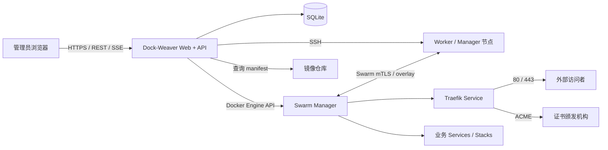

# Dock-Weaver 产品与技术规划

> 文档状态：Draft 0.1  
> 目标：把一台 Linux 服务器初始化为 Docker Swarm Manager，并通过 Web 页面完成节点纳管、Docker 版本统一、Traefik 自动 HTTPS 和应用版本部署。

## 1. 产品定位

Dock-Weaver 是一个“先装控制面，再从控制面扩展集群”的轻量级 Docker Swarm 管理工具。

它解决以下核心问题：

1. 用户可以指定 Docker Engine 版本，在首台服务器上一键安装 Docker、初始化 Swarm、部署 Dock-Weaver。
2. Dock-Weaver 启动 Web 管理页面，不要求用户日常手写 Swarm 命令。
3. 用户通过 SSH 添加其他 Linux 服务器；系统完成环境检查、安装同一 Docker 版本并将节点加入 Swarm。
4. 系统安装和管理 Traefik，通过域名自动发现路由并申请、续期 HTTPS 证书。
5. 用户录入镜像仓库、镜像版本和部署参数后即可创建或升级服务，并看到完整过程、健康状态和回滚入口。

### 1.1 目标用户

- 有 2～20 台 Linux 服务器的小型团队或个人开发者。
- 希望保留 Docker/Compose 的使用习惯，但不想引入 Kubernetes 的用户。
- 需要可重复部署、滚动更新、自动 HTTPS 和基础集群管理能力的自托管场景。

### 1.2 首版不做

- 不把 Dock-Weaver 做成通用服务器运维面板。
- 不提供 Kubernetes、Nomad 或单机 Docker 编排。
- 不负责域名注册；首版仅检查 DNS 是否正确解析，DNS 服务商 API 集成放到后续版本。
- 不在首版实现多 Dock-Weaver 实例主动写入同一集群。
- 不提供完整 CI/CD；首版通过页面或 API 触发部署，Webhook 放到后续版本。

## 2. 使用体验

### 2.1 首台 Manager 安装

用户在准备作为 Manager 的 Linux 宿主机上运行一条安装命令。首个正式版本发布后，`<owner>` 替换为实际的 GitHub 组织或用户：

```bash
curl -fsSL https://github.com/<owner>/dock-weaver/releases/latest/download/install.sh \
  | sudo bash
```

需要指定 Docker Engine 版本或 Manager 地址时，通过非交互参数传入：

```bash
curl -fsSL https://github.com/<owner>/dock-weaver/releases/latest/download/install.sh \
  | sudo bash -s -- \
      --docker-version <目标版本> \
      --advertise-addr <Manager固定IP> \
      --web-port 8080
```

安装器按以下步骤执行：

1. 检查操作系统、CPU 架构、root/sudo 权限、网络端口和现有 Docker/Swarm 状态。
2. 从 Docker 官方软件源读取该发行版可安装版本，并验证用户指定的版本。
3. 安装固定版本的 Docker Engine、CLI、containerd 和 Compose 插件。
4. 配置 Docker 服务开机启动，验证 daemon 可用。
5. 使用固定管理地址初始化 Swarm。
6. 创建 Dock-Weaver 所需的 overlay 网络、数据目录、Docker secrets 和节点标签。
7. 以固定版本镜像和 Swarm service 方式启动 Dock-Weaver，并约束在带有控制标签的 Manager 节点上。
8. 等待 Dock-Weaver readiness 检查成功。
9. 输出可直接在浏览器打开的 Web 初始化地址，例如 `http://<manager-ip>:8080/setup`，以及一次性初始化令牌和后续必要操作。

若主机已经安装 Docker，安装器不得静默覆盖：先展示当前版本、目标版本及升级/降级风险，只有明确传入允许参数后才变更。

由于 `curl | sudo bash` 会直接以 root 权限运行远程内容，正式发布时还必须提供“下载 → 查看 → 校验 checksum → 执行”的等价安装方式。Bootstrap 脚本下载的镜像以外的所有发布文件都必须验证 checksum 或签名。

### 2.2 首次进入 Web 页面

首次向导包括：

1. 使用一次性令牌创建首个管理员账号。
2. 设置站点名称、时区和日志保留时间。
3. 确认 Manager 的 advertise address 与对外访问地址。
4. 配置镜像仓库凭证，可跳过公共仓库配置。
5. 配置 Traefik：域名、ACME 邮箱、证书挑战方式和入口节点。
6. 运行集群健康检查并进入总览页。

一次性令牌使用后立即失效，并且不得写入常规应用日志。

### 2.3 添加服务器

用户在“节点 → 添加节点”中填写：

- 主机名或 IP、SSH 端口、SSH 用户。
- 身份验证方式：私钥优先，密码作为兼容选项。
- sudo 方式。
- 节点角色：Worker 或 Manager。
- advertise address、data path address，可选择自动探测。
- 节点标签，例如 `region=shanghai`、`disk=ssd`。

执行流程：

```text
SSH 连通性检查
  → 主机指纹确认
  → 系统与端口预检
  → 检查已有 Docker/Swarm
  → 查询目标版本在该主机是否可用
  → 安装或对齐 Docker 版本
  → 获取短时 join token
  → 加入 Swarm
  → Manager 侧确认节点 Ready
  → 写入节点标签
  → 清理远端临时文件与敏感信息
```

每一步均展示状态、耗时和脱敏日志。失败后允许从安全步骤重试，而不是从头重复执行。

### 2.4 部署应用

首版提供两种入口：

#### 简单表单

- 应用名、服务名。
- 镜像仓库，例如 `registry.example.com/team/api`。
- 镜像版本，例如 `1.4.2`；禁止默认使用 `latest`，允许用户显式放开。
- 容器内部端口。
- 副本数、CPU/内存限制。
- 环境变量、Docker secrets/configs。
- 域名、路径、HTTPS 开关。
- 健康检查、滚动升级和失败回滚策略。
- 节点约束和网络。

#### Stack YAML

高级用户可导入兼容 `docker stack deploy` 的 Compose 文件。系统在保存前完成 schema、镜像、网络、secret 引用和 Traefik label 检查，并展示最终差异。

点击“部署”后：

1. 规范化并校验部署规格。
2. 如有私有仓库，验证凭证和镜像 manifest 是否存在。
3. 尽可能将 tag 解析为 digest，并在部署记录中保存 tag 与 digest。
4. 生成 Swarm service/stack 规格和 Traefik service labels。
5. 创建或滚动更新服务。
6. 观察任务进入 Running、健康检查通过、Traefik 路由可达。
7. 达到成功条件后完成部署；超时或失败时按策略暂停或自动回滚。

同一个应用再次输入新版本时，页面应展示：

```text
当前：registry.example.com/team/api:1.4.2
目标：registry.example.com/team/api:1.5.0
策略：先启动后停止，parallelism=1，失败自动回滚
```

## 3. 总体架构



### 3.1 推荐技术栈

- 后端：Go，单二进制，提供 REST API、SSE 任务日志和静态文件服务。
- 前端：React + TypeScript + Vite + shadcn/ui，使用 Tailwind CSS，构建后嵌入 Go 二进制。
- 数据库：MVP 使用 SQLite WAL，数据卷固定在控制节点。
- Docker 操作：优先使用 Docker Engine Go SDK；只有安装阶段使用受控 shell 命令。
- SSH：Go SSH 客户端，支持私钥、加密私钥和密码，强制 known-hosts 校验。
- 后台任务：数据库持久化任务队列 + 单实例 worker；所有动作具备幂等键。
- 日志：结构化日志；敏感字段在进入日志系统前统一脱敏。

### 3.2 运行单元

首版由一个 Dock-Weaver service 提供 API、页面和任务执行器，副本数为 1，并使用节点约束：

- `node.role == manager`
- `node.labels.dock-weaver.control == true`

这样可以快速交付并保持状态一致。若 Dock-Weaver 暂时不可用，Swarm 中已经运行的服务仍继续运行，但新增、升级和扩缩容操作会暂停。

### 3.3 后续高可用路线

控制面高可用必须单独设计，不能只把 Dock-Weaver 的副本数从 1 改为 3：

- 数据从 SQLite 迁移到 PostgreSQL。
- 使用数据库 advisory lock 或租约实现唯一调度 leader。
- API 可多副本，所有变更使用乐观锁和幂等操作。
- SSH 凭证改用外部 Secret Manager 或加密密钥服务。
- Traefik ACME 文件存储并非分布式存储；在没有外部证书控制器前，Traefik 保持单 ACME 写入实例。

## 4. 核心模块

### 4.1 Bootstrap 安装器

职责：

- 支持 Ubuntu/Debian 首发；RHEL 系发行版作为下一阶段。
- 使用发行版包管理器和 Docker 官方软件源安装，不以静态二进制作为生产默认方案。
- 将用户输入的“Engine 语义版本”映射为各发行版的软件包版本字符串。
- 支持 `--dry-run`，只输出检查结果和即将执行的动作。
- 根目录提供 `install.sh`，正式版本将它作为 GitHub Release asset 发布，支持 `curl -fsSL <release-url>/install.sh | sudo bash`。
- 支持 `--docker-version`、`--advertise-addr`、`--web-port`、`--dock-weaver-version` 和 `--dry-run` 等非交互参数。
- 支持中断后重新执行；已完成动作必须幂等。
- 记录非敏感安装日志，失败时输出明确恢复命令。
- 启动 Swarm service 后轮询 `/health/ready`；只有 Web 已可访问才报告成功。
- 成功输出准确的 `/setup` URL 和一次性初始化令牌；令牌不得进入普通日志。
- 所有下载的发布资产验证 checksum 或签名，并为希望审查脚本的用户提供分步安装文档。

版本策略：

- 集群保存一个 `desired_docker_version`。
- 所有新节点必须先通过“版本在该发行版可用”的检查。
- MVP 要求同一 Linux 发行版家族；跨发行版时允许 Engine 版本一致，但软件包版本字符串可以不同。
- 升级采用逐节点 drain → 升级 → 验证 → active，Manager 始终保持 quorum。
- 降级默认禁止，需要单独的危险操作确认和备份检查。

### 4.2 SSH 节点执行器

职责：

- 首次连接显示主机指纹，由用户确认后写入 known hosts。
- 采集 `/etc/os-release`、架构、内核、磁盘、内存、IP、时间同步和现有 Docker 状态。
- 上传带校验和的临时脚本或逐条执行经过白名单化的命令。
- 对每个阶段设置超时、取消和重试策略。
- 远端输出实时推送到页面，但过滤密码、私钥、registry token、join token。
- 完成或失败后删除远端临时文件。

SSH 密码不建议长期保存。私钥如需保存，必须使用实例主密钥进行 envelope encryption；主密钥通过 Docker secret 注入，不写入 SQLite 和镜像。

### 4.3 Swarm 管理器

功能：

- 初始化、查看和更新 Swarm 基础配置。
- 添加、删除、提升、降级和 drain 节点。
- 展示 Leader、Reachable、Ready、Availability 和 Engine 版本。
- 管理 node labels。
- 管理 overlay 网络、configs 和 secrets。
- 查询 service、task、event，并映射为用户可理解的状态。
- 对 manager 变更执行 quorum 保护。

保护规则：

- Manager 推荐 1、3 或 5 个，不建议 2 或 4 个。
- 任何降级、删除、重启或升级 Manager 的操作前都计算剩余 quorum。
- 无法保持 quorum 时禁止执行并明确说明原因。
- join token 仅在添加节点动作开始时读取，传输后立即从内存清除，不持久化、不记录；支持操作后轮换。

### 4.4 Traefik 管理器

初始部署内容：

- 创建 `traefik-public` attachable overlay 网络。
- 部署 Traefik Swarm provider，`exposedByDefault=false`。
- Traefik 约束到入口 Manager 节点，因为 Swarm API 位于 Manager。
- 发布 80/443；Dashboard 默认不直接暴露公网。
- 为 ACME 存储创建权限受限的持久目录。
- 配置 HTTP 到 HTTPS 重定向、安全响应头和可选 Dashboard 鉴权。

自动 HTTPS 前置条件：

- 域名 A/AAAA 记录指向能接收 Traefik 80/443 流量的公网地址。
- 防火墙或云安全组允许 80/443。
- HTTP-01 需要 80 可从公网访问；若做泛域名或 80 不可用，则使用 DNS-01。
- MVP 推荐 HTTP-01，Traefik 单副本负责 ACME，避免多个实例同时写 `acme.json`。
- 证书申请失败要显示 DNS 解析、端口探测、速率限制和 challenge 日志，但不泄露账户密钥。

业务服务在 Swarm 模式下将 Traefik labels 写在 service 的 `deploy.labels`，并显式提供容器内部端口。例如生成：

```yaml
deploy:
  labels:
    - traefik.enable=true
    - traefik.http.routers.demo.rule=Host(`demo.example.com`)
    - traefik.http.routers.demo.entrypoints=websecure
    - traefik.http.routers.demo.tls=true
    - traefik.http.routers.demo.tls.certresolver=letsencrypt
    - traefik.http.services.demo.loadbalancer.server.port=8080
```

### 4.5 应用与部署管理器

领域对象分为三层：

- Application：用户视角的应用。
- Deployment Spec：期望状态，包括镜像、资源、路由和升级策略。
- Release：一次不可变部署记录，保存操作者、时间、输入、最终 digest、结果和回滚来源。

推荐更新默认值：

- `parallelism=1`
- `order=start-first`
- 单任务健康后再进入下一批
- `failure_action=rollback`
- 设置 monitor window 和最大失败比例

必须允许用户在资源不足或端口冲突场景下选择 `stop-first`。

部署状态机：

```text
DRAFT → VALIDATING → DEPLOYING → VERIFYING → SUCCEEDED
                    ↘ FAILED
             VERIFYING → ROLLING_BACK → ROLLED_BACK / ROLLBACK_FAILED
```

服务端负责状态推进，刷新浏览器不会中断任务。相同幂等键的重复请求只能产生一个 Release。

### 4.6 认证、授权与审计

MVP 角色：

- Owner：系统设置、用户管理和全部操作。
- Operator：节点维护、部署、回滚和扩缩容。
- Viewer：只读。

安全要求：

- 密码使用现代密码哈希算法并设置合理成本。
- 登录 session 使用 HttpOnly、Secure、SameSite Cookie，所有变更请求启用 CSRF 防护。
- 支持登录限速、短时锁定和 session 撤销。
- registry 密码、SSH 凭证、ACME 密钥和 Docker secrets 加密保存或外部注入。
- Docker socket 等同 root 权限；Dock-Weaver 容器不得与普通业务容器共享不必要权限，并限制只有控制 service 可访问。
- 所有节点变更、部署、回滚、secret 变更和登录事件写入不可由普通用户修改的审计日志。

## 5. 页面规划

| 页面 | 首版主要内容 |
|---|---|
| 初始化向导 | 管理员、集群地址、镜像仓库、Traefik、健康检查 |
| 总览 | 节点健康、Manager quorum、服务/副本状态、最近部署、证书告警 |
| 节点列表 | 角色、状态、可用性、Docker 版本、资源、标签、操作 |
| 添加节点 | SSH 配置、主机指纹、预检、安装和入群分步日志 |
| 应用列表 | 当前版本、副本健康、域名、最近部署结果 |
| 新建/编辑应用 | 镜像、版本、端口、资源、环境变量、secrets、域名、升级策略 |
| Release 详情 | 规格差异、任务时间线、日志、健康验证、回滚 |
| Traefik/证书 | 入口点、域名、证书状态、过期时间、challenge 检查 |
| 集群资源 | Networks、Configs、Secrets；secret 只能创建/替换，不能回显 |
| 系统设置 | 用户、镜像仓库、SSH 凭证、备份、审计、版本策略 |

## 6. 数据模型草案

| 表 | 关键字段 |
|---|---|
| `users` | id, username, password_hash, role, disabled_at |
| `sessions` | id, user_id, token_hash, expires_at, revoked_at |
| `settings` | key, encrypted_value/value, updated_at |
| `ssh_credentials` | id, name, kind, username, encrypted_secret, fingerprint |
| `hosts` | id, address, ssh_port, os, arch, engine_version, swarm_node_id |
| `node_operations` | id, host_id, type, status, current_step, error_code |
| `applications` | id, name, slug, description |
| `deployment_specs` | id, app_id, version, spec_json, created_by |
| `releases` | id, app_id, spec_id, image_tag, image_digest, status, idempotency_key |
| `release_events` | id, release_id, level, phase, redacted_message, created_at |
| `registry_credentials` | id, registry, username, encrypted_secret |
| `audit_events` | id, actor_id, action, resource_type, resource_id, redacted_detail |

SQLite 迁移必须带 schema version；所有 JSON 规格需保存自身版本号，为后续字段升级保留转换路径。

## 7. API 草案

```text
POST   /api/v1/setup/complete
POST   /api/v1/auth/login
POST   /api/v1/auth/logout

GET    /api/v1/cluster
GET    /api/v1/cluster/health
GET    /api/v1/nodes
POST   /api/v1/nodes/preflight
POST   /api/v1/nodes
GET    /api/v1/node-operations/{id}
GET    /api/v1/node-operations/{id}/events
POST   /api/v1/nodes/{id}/drain
POST   /api/v1/nodes/{id}/activate
POST   /api/v1/nodes/{id}/upgrade
DELETE /api/v1/nodes/{id}

GET    /api/v1/apps
POST   /api/v1/apps
GET    /api/v1/apps/{id}
PUT    /api/v1/apps/{id}
POST   /api/v1/apps/{id}/validate
POST   /api/v1/apps/{id}/releases
GET    /api/v1/releases/{id}
GET    /api/v1/releases/{id}/events
POST   /api/v1/releases/{id}/rollback

GET    /api/v1/traefik
PUT    /api/v1/traefik
POST   /api/v1/traefik/check-domain
GET    /api/v1/certificates

GET    /api/v1/audit-events
```

长任务接口立即返回 operation/release ID；页面通过 SSE 订阅事件。所有创建部署、节点操作和回滚 API 接收 `Idempotency-Key`。

## 8. 网络与基础设施要求

在加入节点前，预检以下连通性：

| 方向 | 端口 | 用途 |
|---|---:|---|
| 管理端到目标主机 | SSH 端口，默认 22/TCP | 安装与维护 |
| Swarm 节点之间 | 2377/TCP | Manager 控制面 |
| Swarm 节点之间 | 7946/TCP + UDP | 节点发现与通信 |
| Swarm 节点之间 | 4789/UDP | overlay 数据面 |
| 公网到入口节点 | 80/TCP | HTTP 与 ACME HTTP-01 |
| 公网到入口节点 | 443/TCP | HTTPS |
| 节点到外部 | 443/TCP | 软件源、镜像仓库、ACME API |

安全组检查不能只验证本机监听，还应尽可能从 Manager 和目标节点双向验证。`4789/UDP` 不应直接暴露给不可信公网。

## 9. 失败处理与可恢复性

### 9.1 添加节点失败

- SSH/指纹失败：不执行远端变更。
- Docker 版本不可用：停止在安装前，展示该发行版的候选版本。
- Docker 安装成功但 join 失败：保留 Docker，撤销临时文件，允许只重试 join。
- join 成功但 Manager 未看到 Ready：采集 daemon、时间同步、端口和证书状态，不自动重复 join。

### 9.2 部署失败

- 镜像不存在或无权限：验证阶段失败，不改变线上服务。
- 新任务不能启动：展示 Swarm task error、资源和 placement 约束。
- 健康检查失败：按配置暂停或回滚。
- 回滚也失败：保留失败现场，标记 `ROLLBACK_FAILED`，不制造“已恢复”的假象。

### 9.3 控制节点故障

- 已运行的 Swarm tasks 继续由 Swarm 维护；若 Manager quorum 丢失，则不能执行新的管理操作。
- 定期备份 SQLite、实例加密密钥材料和 `/var/lib/docker/swarm`；Swarm 状态备份需要遵循一致性要求。
- 恢复文档必须覆盖：恢复 Dock-Weaver、恢复单 Manager、重建 quorum、重新验证 Traefik 和证书。

## 10. 可观测性

MVP 指标：

- 节点 Ready/Down、Manager reachability、quorum 风险。
- service desired/running/failed replicas。
- deployment duration、success/failure/rollback 数量。
- SSH 操作时长和错误分类。
- 证书剩余有效期、最近续期结果。
- Docker/Traefik/Dock-Weaver 版本分布。

提供 `/health/live`、`/health/ready` 和 Prometheus `/metrics`。日志关联 `request_id`、`operation_id`、`release_id`，禁止写入 secret 值。

## 11. 开发阶段与里程碑

### Phase 0：工程骨架与设计冻结

交付：

- Go API、嵌入式前端、SQLite migrations、基础认证。
- 领域模型、错误码规范、任务状态机和脱敏库。
- 开发环境中的多节点 Swarm 测试脚本。

验收：可以登录 Web 页面，持久化配置并查看空集群状态。

### Phase 1：首节点安装与集群只读

交付：

- Ubuntu/Debian 安装器，可选并固定 Docker 版本。
- 初始化 Swarm并以 service 启动 Dock-Weaver。
- 节点、服务、任务、网络只读页面。

验收：在干净主机上从零安装后，浏览器可访问 Dock-Weaver，并能正确显示单 Manager Swarm。

### Phase 2：SSH 添加节点

交付：

- SSH 凭证、known-hosts、预检、远程安装、join 和分步日志。
- Worker/Manager 角色、节点标签、drain/activate/remove。
- Docker 版本一致性告警和 quorum 保护。

验收：两台干净主机可从页面加入；失败可定位、可安全重试，日志无敏感信息。

### Phase 3：Traefik 与自动 HTTPS

交付：

- `traefik-public` 网络和 Traefik stack/service。
- HTTP-01 自动证书、HTTP→HTTPS、域名预检和证书状态页面。
- Dashboard 的安全访问方式。

验收：配置 DNS 后部署测试服务，可通过有效 HTTPS 域名访问，重启 Traefik 后证书仍存在。

### Phase 4：应用部署、升级与回滚

交付：

- 简单部署表单、私有 registry、secrets/configs。
- image tag/digest 校验、滚动更新、健康验证、失败回滚。
- Release 历史、规格 diff 和 SSE 实时事件。

验收：可从 `1.0.0` 升级到 `1.1.0`；模拟健康失败后自动恢复到旧版本；重复点击不会重复创建部署。

### Phase 5：生产加固

交付：

- RBAC、审计、备份恢复、指标、告警。
- 节点滚动升级 Docker。
- RHEL 系支持、DNS-01 插件、Webhook/API token。
- 安全审计与端到端故障演练。

验收：完成 Manager 故障、节点断网、镜像不可用、证书失败、数据库恢复和升级中断演练。

## 12. 测试策略

- 单元测试：版本解析、规格生成、状态机、quorum 计算、secret 脱敏、权限判断。
- 集成测试：Docker API、registry manifest、SQLite migration、SSH 执行器。
- 端到端测试：用 3 个隔离 Linux 环境组成 Swarm，覆盖安装、join、Traefik、部署、升级、回滚和移除。
- 幂等测试：在每个安装/部署阶段强制中断后重新执行。
- 安全测试：主机指纹变化、命令注入、CSRF、弱密码、越权、secret 日志泄漏。
- 兼容测试：支持矩阵中的发行版、架构和 Docker Engine 版本。
- 故障测试：Manager 下线、丢失 quorum、Worker 下线、registry 超时、ACME 不可达。

## 13. MVP 完成定义

以下条件全部满足才算 MVP 完成：

1. 用户能在支持的干净 Linux 主机上选择 Docker 版本并完成首个 Manager 安装。
2. 用户能通过 Web + SSH 添加至少两个节点，所有节点 Docker Engine 版本符合策略且状态为 Ready。
3. 用户能部署带域名的镜像版本，Traefik 自动获得有效证书并提供 HTTPS。
4. 用户能升级镜像版本、看到实时过程，并在失败时自动或手动回滚。
5. Manager quorum、端口、防火墙、DNS、镜像和证书问题都有明确诊断。
6. SSH、registry、join token、session 和应用 secret 不以明文写入数据库或日志。
7. 安装、节点纳管和部署操作均可重试且具备幂等性。
8. 有可执行的备份恢复文档，并至少完成一次恢复演练。

## 14. 已确定的关键决策

| 决策 | 选择 | 原因 |
|---|---|---|
| 控制面形态 | Go 单二进制 + 内嵌 SPA | 安装简单、资源占用低、适合 Manager 节点 |
| 节点纳管 | Agentless SSH | 用户无需预装 agent，适合小集群 |
| 首版数据存储 | SQLite + 单控制副本 | 降低 MVP 运维复杂度 |
| Docker 安装 | 官方仓库 + 包管理器 | 可固定版本并保留安全更新路径 |
| 应用编排 | Swarm service/stack | 与产品目标一致，保留 Compose 心智模型 |
| 入口网关 | Traefik Swarm provider | 通过 service labels 自动发现路由 |
| MVP ACME | HTTP-01 + 单 Traefik 副本 | 文件型 ACME 存储不适合并发写入 |
| 部署版本 | tag 输入、digest 落库 | 兼顾易用性和可重复部署 |
| 长任务反馈 | 持久化任务 + SSE | 刷新不丢任务，页面可实时显示过程 |

## 15. 开始编码前仍需确认的产品选择

这些问题不阻塞架构规划，但应在对应 Phase 开始前冻结：

1. 首发只支持 Ubuntu，还是同时支持 Debian。
2. Dock-Weaver 首次访问是使用 `IP:8080`，还是安装时就要求提供管理域名。
3. SSH 密码是否允许持久保存，还是只允许单次使用。
4. 简单部署表单是否需要同时支持多 service 应用；本规划建议 MVP 一个应用可包含一个 service，高级用户使用 Stack YAML。
5. 私有 registry 首发范围是通用 Registry V2，还是额外适配特定厂商。
6. 是否需要从现有 Swarm 导入并接管已有 service；本规划建议先只读展示，用户确认后再纳入 Application/Release 模型。

## 16. 实施参考

- Docker Engine 支持从官方软件源列出并安装指定软件包版本，安装器应按发行版查询候选版本，而不是维护一张易过期的硬编码列表。
- Swarm 的 worker/manager join token 是敏感凭据；节点只在加入时需要它，Dock-Weaver 应按需读取并避免持久化。
- Swarm 节点间默认需要开放 `2377/TCP`、`7946/TCP+UDP` 和 `4789/UDP`。
- Manager 使用 Raft quorum，生产环境通常采用奇数个 Manager；失去 quorum 后现有 task 可能继续运行，但管理和调度操作不可用。
- Traefik 的 Swarm provider 从 service labels 读取路由配置；在 Swarm 中必须显式配置后端容器端口。
- Traefik ACME resolver 的文件存储不是分布式存储，因此首版自动证书组件按单写入实例设计。

官方资料：

- [Docker：安装指定版本的 Docker Engine](https://docs.docker.com/engine/install/ubuntu/)
- [Docker：运行 Swarm Mode](https://docs.docker.com/engine/swarm/swarm-mode/)
- [Docker：Swarm 网络与端口](https://docs.docker.com/engine/swarm/networking/)
- [Docker：维护 Manager quorum](https://docs.docker.com/engine/swarm/admin_guide/)
- [Traefik：Docker Swarm Provider](https://doc.traefik.io/traefik/reference/install-configuration/providers/swarm/)
- [Traefik：Certificate Resolver](https://doc.traefik.io/traefik/reference/install-configuration/tls/certificate-resolvers/overview/)

## 17. 开源与许可证

Dock-Weaver 是永久免费、完整开源的自托管项目，使用 `AGPL-3.0-only` 许可证。

项目原则：

- 不按服务器、Swarm 节点、用户或应用数量收费。
- 节点安装、集群管理、Traefik、自动 HTTPS、部署、滚动更新和回滚属于免费核心能力。
- 不要求连接 Dock-Weaver 官方云服务才能运行。
- 默认不启用未经用户明确同意的遥测，不采集服务器凭证、应用 secrets 或业务数据。
- 官方容器镜像必须能够从公开源代码和发布标签重现。
- Web 页面应提供清晰的源代码入口，并显示运行版本和构建 commit，使使用者能够取得与当前运行版本对应的源代码。
- 可以通过赞助、托管服务、技术支持、迁移实施、培训和定制开发维持项目发展，但不得让自托管核心功能依赖付费服务。

仓库根目录的 `AGENTS.md` 是实现阶段的技术栈和工程约束来源；架构决定发生变化时，应同时更新该文件和本规划。
